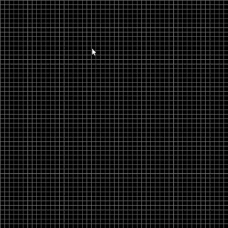
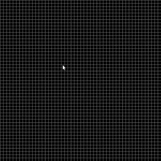

`pico-Céu` is a tiny programming environment for visual and interactive
applications such as video games.
It is composed of the programming language [Céu](www.ceu-lang.org/) and
minimalist libraries for input, graphics, network, and sound.

Follows an example that draws a line pixel by pixel from the top-left towards
the bottom-right of the screen, one pixel every *100ms*:

<!--
It also plays sound effects at the beginning and at the end of the process:

await KEY_PRESS;                    // waits for a key press (any key)
emit SOUND_PLAY("click.wav");       // plays a starting sound

emit SOUND_PLAY("click.wav");       // plays a terminating sound
await KEY_PRESS;                    // waits for a key press (any key)
-->



```ceu
var integer i;
loop i in [0 -> 49] do              // executes 50 times, varying i from 0 to 49
    emit GRAPHICS_DRAW_PIXEL(i,i);  //   draws a pixel at (i,i)
    await 100ms;                    //   waits for 100 milliseconds
end
```

The next example draws, at the same time, an additional line from the top-right
towards the bottom-left of the screen:



```ceu
par/and do  // executes the next five indented lines in parallel...
    var integer i;
    loop i in [0 -> 49] do
        emit GRAPHICS_DRAW_PIXEL(i,i);      // draws from (0,0) to (49,49)
        await 100ms;
    end
with        // ...with the next five indented lines...
    var integer i;
    loop i in [0 -> 49] do
        emit GRAPHICS_DRAW_PIXEL(49-i,i);   // draws from (49,0) to (0,49)
        await 100ms;
    end
end         // ...and terminates when they both terminate (par/and)
```

`pico-Céu` design goals:

- Structured programming model:
    - sequential execution, no callbacks
    - logical parallelism, deterministic concurrency
- Explicit I/O operations:
    - `await` for input
    - `emit` for output
- Straightforward graphics:
    - immediate feedback
    - pixel-level manipulation and visualization
- Simple development cycle:
    - minimalist API
    - easy installation and execution

`pico-Céu` inspirations:

- [pico-8](https://www.lexaloffle.com/pico-8.php):
    - minimalist and focused programming environment
- [Basic](http://www.hoist-point.com/applesoft_basic_tutorial.htm):
    - graphics with immediate feedback
    - text and cursor facilities
- [Pascal](https://en.wikipedia.org/wiki/Pascal_%28programming_language%29):
    - verbose and comprehensible syntax

# Installation

## Windows

<https://github.com/fsantanna/pico-ceu/tree/master/windows>

# Documentation

## API Manual:

<https://fsantanna.github.io/pico-ceu/out/manual/v0.30/>
