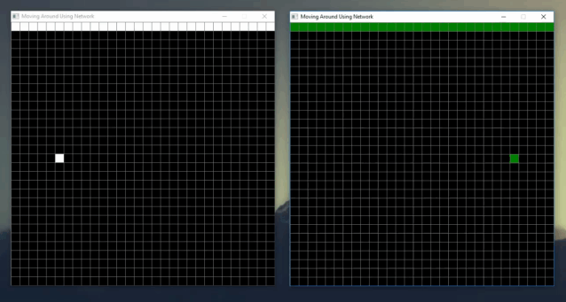

# Move around using NETWORK features
In [move.ceu](../move.ceu) example, the user can move a pixel around the window using the keyboard arrow keys. 

This example is based on move.ceu, so, if you are starting programming with Céu, is recommended to that a look on it and understant its code.



In this application, we use pico-Céu [Network features](https://ceu-lang.github.io/pico-ceu/out/manual/v0.30/net/#net_receive) to create a distributed version of move.ceu. It supports two users moving independent pixels and, as seen in the figure above, show the movement of the pixels in both instances of the example.

# First steps
Let's start from the move.ceu example. Copy and paste the code to a new file and change the size of the window using the ```WINDOW_SET_SIZE```, and its title, using ```WINDOW_SET_TITLE```. Also, make sure to uncomment the lines responsible for clearing the old pixel position.

```c#
#define INSTANCE 1

//CONFIG THE WINDOW
emit WINDOW_SET_SIZE(30*20, 30*20, 30, 30);
emit WINDOW_SET_TITLE("Moving Around Using Network");

var integer x = 0;
var integer y = 0;

//DRAW THE PIXEL IN THE INITIAL POSITION
emit GRAPHICS_DRAW_PIXEL(x,y);

var integer key;

//EXECUTE ON EVERY KEY PRESS
every key in KEY_PRESS do   

    //CLEAR THE OLD POSITION                  
    emit GRAPHICS_SET_COLOR_NAME(COLOR_BLACK);
    emit GRAPHICS_DRAW_PIXEL(x,y);

    //MOVE IN FOUR DIRECTIONS
    if key == KEY_LEFT then
        x = x - 1;
    else/if key == KEY_RIGHT then
        x = x + 1;
    else/if key == KEY_UP then
        y = y + 1;
    else/if key == KEY_DOWN then
        y = y - 1;
    end

    //DRAW THE PIXEL IN A NEW POSITION
    emit GRAPHICS_SET_COLOR_NAME(COLOR_WHITE);
    emit GRAPHICS_DRAW_PIXEL(x,y);
end
```

# Supporting two different instances of move.ceu
We use preprocessor directives to define which instance (white or green) will be compilled. Check [this tutorial to learn more about preprocessor directives](https://www.tutorialspoint.com/cprogramming/c_preprocessors.htm).

```c#
#define INSTANCE 1

//EACH INSTANCE INITIATES WITH A DIFFERENT COLOR AND POSITION
#if INSTANCE == 1
    #define MAIN_COLOR COLOR_WHITE
    #define INITIAL_POSITION_X -10
    #define INITIAL_POSITION_Y 0
#elif INSTANCE == 2
    #define MAIN_COLOR COLOR_GREEN
    #define INITIAL_POSITION_X 10
    #define INITIAL_POSITION_Y 0    
#endif
```

In the beggining of the code, we defined ```INSTANCE``` with the value ```1``` and then, the ```MAIN_COLOR``` (the color that will be used to draw the pixel and a top bar) and the pixel initial position depending on the value of ```INSTANCE``` (```INITIAL_POSITION_X``` and ```INITIAL_POSITION_Y```).

With the value 1, the example will be compiled with the pixel located on the left side of the window and the color white. With the value 2, otherwise, the pixel will be green and located on the right side.

## Displaying the top bar
To display the top bar, we can use a rectangle with height equals 1, and width equals 30 (the width of the window). In Céu, the anchor of the drawing operations is, by default, the center of the shape. So, for the rectangle occupies all the top of the window, we define its position as 0 for the x-axis (the center of the x-axis).

> The anchor specifies the part of the shape to appear at the pixel position of the drawing operation.

Its position in the y-axis is 15 so that the bar is located on the top. It's interesting to note that the anchor vertical position is irrelevant, since the rectangle height is equal to 1.

Check [pico-Céu manual](https://ceu-lang.github.io/pico-ceu/out/manual/v0.30/graphics/#graphics_set_anchor) to learn more about anchors.

```c#
//DISPLAY A RECTANGLE ON THE TOP OF THE SCREEN TO INDICATE WHICH INSTANCE YOU ARE
emit GRAPHICS_SET_COLOR_NAME(MAIN_COLOR);
emit GRAPHICS_DRAW_RECT(0, 15, 30, 1);
```

To set the color of the rectangle, we use the ```MAIN_COLOR``` defined above. Before compiling, the pre-processor will replace the ```MAIN_COLOR``` with ```COLOR_WHITE``` or ```COLOR_GREEN```, depending on the value of the ```INSTANCE```.

Add the above code after the window configuration and execute the example defining the ```INSTANCE``` as 1, and, after, as 2.

## Defining the initial pixel position
To each instance have a different initial pixel position, just use the ```INITIAL_POSITION_X``` and ```INITIAL_POSITION_Y``` to initialize the x and y variables.

```c#
var integer x = INITIAL_POSITION_X;
var integer y = INITIAL_POSITION_Y;
```

## Changing the pixel color
Compiling the code we can see that the pixel is already with the ```MAIN_COLOR```, but returns to color white after a movement. It initiates with the ```MAIN_COLOR``` because this is the last color defined before the initial pixel draw:
```c#
// <...>
emit GRAPHICS_SET_COLOR_NAME(MAIN_COLOR);
emit GRAPHICS_DRAW_RECT(0, 15, 30, 1);

var integer x = 0;
var integer y = 0;

//DRAW THE PIXEL IN THE INITIAL POSITION
emit GRAPHICS_DRAW_PIXEL(x,y);
// <...>
```

But when we display the pixel inside the ```every``` the last color definded is ```COLOR_WHITE```:
```c#
// <...>
//DRAW THE PIXEL IN A NEW POSITION
emit GRAPHICS_SET_COLOR_NAME(COLOR_WHITE);
emit GRAPHICS_DRAW_PIXEL(x,y);
// <...>
```
We, then, simply have to replace ```COLOR_WHITE``` with ```MAIN_COLOR```.

# Stopping the pixel from exiting through the window

Currently, the pixel can movement outside the window. To stop that, we can verify if it can moves to the desirable position before modify its x-axis and y-axis position.

```c#
//MOVE IN FOUR DIRECTIONS
if key == KEY_LEFT then
    //WINDOW COLLISION WITH LEFT SIDE
    if x > -15 then
        x = x - 1; 
    end
else/if key == KEY_RIGHT then
    //WINDOW COLLISION WITH RIGHT SIDE
    if x < 14 then
        x = x + 1;
    end
else/if key == KEY_UP then
    //WINDOW COLLISION WITH TOP SIDE
    if (y < 13) then
        y = y + 1;
    end
else/if key == KEY_DOWN then
    //WINDOW COLLISION WITH BOTTOM SIDE
    if (y > -14) then
        y = y - 1;
    end
end
```

The -15 and 14 (respectively located in lines 4 and 9) are the leftmost and the rightmost x-axis positions of the window. The -14 (in line 19), is, likely, the bottommost y-axis position, but the 13 (in line 14) isn't the topmost. Since we have the top bar, the pixel cannot move until the top.

# Adding network 

An instance of this example sends a broadcast message (i.e. sends a message to all peers in the network) every time the user clicks a keyboard arrow key. This message contains which instance is sending, the current location of the pixel and to where it is moving (the new x and y values).

An instance also have to receive messages from all peers, including itself. When receive a message, it cleans the current location of the pixel and draw the new one. It also uses the instance identifier sent with the message to verify with which color it should draw the pixel.

Our application must be resposive to keyboard clicks and incoming messages. Since we want our application to do two things at same time, let's use a parallel compositon.

> The parallel statement ```par``` fork the running trail in multiple others.

```c#
par do
    // WAIT A MESSAGE ARRIVES FROM ALL PEERS, INCLUDING ITSELF
    // AND DRAW THE PIXEL DESCRIBED IN THE MESSAGE
with
    // REACTS TO KEYBOARD CLICKS BY CALCULATING NEW POSITIONS
    // FOR A PIXEL AND SENDING THEM VIA BROADCAST
end
```

Include the above code after the top bar draw. The rest of the code (from the ```var integer x = INITIAL_POSITION_X;``` will be reused inside the ```par``` composition).

## Sending a message
```c#
with
    var integer currentX = INITIAL_POSITION_X;
    var integer currentY = INITIAL_POSITION_Y;
    var integer nextX = currentX;
    var integer nextY = currentY;    
    var integer key;

    //DRAW THE PIXEL IN THE INITIAL POSITION
    emit GRAPHICS_DRAW_PIXEL(currentX, currentY);

    //EXECUTE ON EVERY KEY PRESS
    every key in KEY_PRESS do
        currentX = nextX;
        currentY = nextY;
        
        //MOVE IN FOUR DIRECTIONS
        if key == KEY_LEFT then
            //WINDOW COLLISION WITH LEFT SIDE
            if nextX > -15 then
                nextX = nextX - 1; 
            end
        else/if key == KEY_RIGHT then
            //WINDOW COLLISION WITH RIGHT SIDE
            if nextX < 14 then
                nextX = nextX + 1;
            end
        else/if key == KEY_UP then
            //WINDOW COLLISION WITH TOP SIDE
            if nextY < 13 then
                nextY = nextY + 1;
            end
        else/if key == KEY_DOWN then
            //WINDOW COLLISION WITH BOTTOM SIDE
            if nextY > -14 then
                nextY = nextY - 1;
            end
        end

        //GENERATE A STRING TO SEND VIA BROADCAST
        var[18] byte send;
        call String_Append_INT(&send, INSTANCE, _);
        call String_Append_STR(&send, ",");
        call String_Append_INT(&send, nextX, _);
        call String_Append_STR(&send, ",");
        call String_Append_INT(&send, nextY, _);
        call String_Append_STR(&send, ",");
        call String_Append_INT(&send, currentX, _);
        call String_Append_STR(&send, ",");
        call String_Append_INT(&send, currentY, _);
        call String_Append_STR(&send, "\0");

        //SEND A STRING VIA BROADCAST
        emit NET_SEND(18, &&send[0]); //0,-00,-00,-00,-00 + \0
    end 
end
```

We renamed the variable ```x``` and ```y``` to ```currentX``` and ```currentY``` to improve semantics. We also moved its definitions down to define its scope inside this parallel trail. We did that because we don't want to have access to these variables from the other trail. 

Next, there is the definition of ```nextX``` and ```nextY```. That variables are responsable to store the updated position after a user click. Initialy (i.e. before the user clicks anything), the ```nextX``` and ```nextY``` are equal the ```currentX``` and ```currentY```.

As said before, this trails must react to keyboard clicks, so we included the "Move in four directions" section, but now its update the ```nextX``` and ```nextY``` variables.

Next, we created the message string and send it via ```NET_SEND```. In the section "generate a string to send via broadcast", we create a byte vector named ```send``` to store the string to be sent and appended the variables ```INSTANCE```, ```nextX```, ```nextY```, ```currentX```, ```currentY```, separated by a coma. 

> The string must supports 18 character because:
- the ```INSTANCE``` stores a integer that can assume the values 1 or 2. So, it only needs 1 character;
- ```nextX```, ```nextY```, ```currentX``` and ```currentY``` needs 3 characters each because they can contain numbers with 2 decimal places, with or without negative sign;
- each coma counts a character;
- until now there is 17 characters. The last is a special character, the ```\0```, that is not printable and is used to indicate that the string ended.

```
0,-00,-00,-00,-00 + \0
```

Finally, we send the message via ```NET_SEND```.

To use the string functions we need to include the ```string.ceu``` library in the beginning of the file:

```
#include "string.ceu"
```

## Receiving and handling a message
In the code below, the first trail waits for a incoming message and stores it the ```buf``` variable. We want to iterate over the caracter of the received string and store each information in a variable (these variables are defined in lines 7 to 11).
This iteration is done in a C code. 

### C code explanation
This code uses a control variable named ```controller``` to identify from which information the current character is. It's like the string was divided by a coma in 5 pieces, which one corresponding to an information/variable (in order, the instance, nextX, nextY and so on). The current character indicates in which place the character being analyzed in the loop is.

Everytime the current character is a ",", the ```controller``` variable is incremented by 1, meanning our code will start to analyze other information, other piece of the string. 

If the current character is not a coma, we will store it in the corresponding variable (lines 37 to 47). 
The code ```strC[i] - '0'``` converts a character to an integer, and the ```@variable*10 + strC[i] - '0'``` simply concatenates the  converted integer with the current variable value, if this value is other than 0 (check [this video](https://youtu.be/3ut27s3wDAk) for a more detailed information).

The position informations (nextX, nextY, currentX and currentY) can contain negative numbers. To support the negative numbers, we declared the ```nextXSignal```, ```nextYSignal```, ```currentXSignal``` and ```currentYSignal``` variables with the default value of 1.

The code between lines 26 and 35 verifies if the current character is a "-". If it is, we store a -1 in one of these variables to simbolize that this information has a negative value.

Then, in lines 52 to 56, we apply the negative signals identified to the position variables, multiplying.
- If the number is negative, the signal variable is -1. The multiplication will result in a negative number;
- If the number is positive, the signal variable is 1. The multiplication will result in a positive number;

-------------------------------------------------------------

```c#
par do
    var integer n;
    var byte&&  buf;

    //WAIT A MESSAGE ARRIVES FROM ALL PEERS, INCLUDING ITSELF
    every (n, buf) in NET_RECEIVE do
        var integer instance = 0;
        var integer nextX = 0;
        var integer nextY = 0;
        var integer currentX = 0;
        var integer currentY = 0;

        {
            //CONVERT A CÉU BYTE VECTOR INTO A C CHAR ARRAY
            const char* strC = @&&buf[0] as _char&&;

            int controller = 0, nextXSignal = 1, nextYSignal = 1, currentXSignal = 1, currentYSignal = 1, i;

            //3. ITERATE OVER THE CHARACTER OF RECEIVED STRING (buf)
            for (i = 0; strC[i] != '\0'; i++){
                //THE RECEIVED STRING CONTAIN INFORMATIONS SEPARATED BY A COMA
                //THE controller VARIABLE INDICATES WHICH INFORMATION WE ARE ACCESSING
                if (strC[i] == ',') {
                    controller = controller + 1;
                } else {
                    if (strC[i] == '-') {
                        //VERIFY WHICH NUMBERS ARE NEGATIVE 
                        if (controller == 1)
                            nextXSignal = -1;
                        else if (controller == 2)
                            nextYSignal = -1;
                        else if (controller == 3)
                            currentXSignal = -1;
                        else if (controller == 4)
                            currentYSignal = -1;
                    } else {
                        //CONVERT THE CURRENT CHARACTER TO A NUMBER
                        if (controller == 0)
                            @instance = @instance*10 + (strC[i] - '0');
                        else if (controller == 1)
                            @nextX = @nextX*10 + (strC[i] - '0'); 
                        else if (controller == 2)
                            @nextY = @nextY*10 + (strC[i] - '0'); 
                        else if (controller == 3)
                            @currentX = @currentX*10 + (strC[i] - '0'); 
                        else if (controller == 4)
                            @currentY = @currentY*10 + (strC[i] - '0');
                    }
                }      
            }
            
            //APPLY THE NEGATIVE SIGNAL
            @nextX = nextXSignal * @nextX;
            @nextY = nextYSignal * @nextY;
            @currentX = currentXSignal * @currentX;
            @currentY = currentYSignal * @currentY;
        }

        //CLEAN THE CURRENT POSITION
        emit GRAPHICS_SET_COLOR_NAME(COLOR_BLACK);
        emit GRAPHICS_DRAW_PIXEL(currentX, currentY);

        //DRAW THE PIXEL IN A NEW POSITION
        if instance == 1 then
            emit GRAPHICS_SET_COLOR_NAME(COLOR_WHITE);       
        else/if instance == 2 then
            emit GRAPHICS_SET_COLOR_NAME(COLOR_GREEN);    
        end 
        emit GRAPHICS_DRAW_PIXEL(nextX, nextY);
    end
with
```

After the C code, we clean the current position using the ```currentX``` and ```currentY``` and draw the pixel in the new position using ```nextX``` and ```nextY```. The color of the new located pixel is chosen by analyzing the variable ```instance``` (acquired from the incoming message).