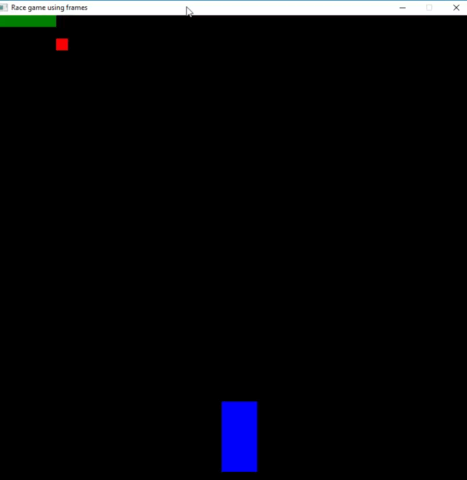
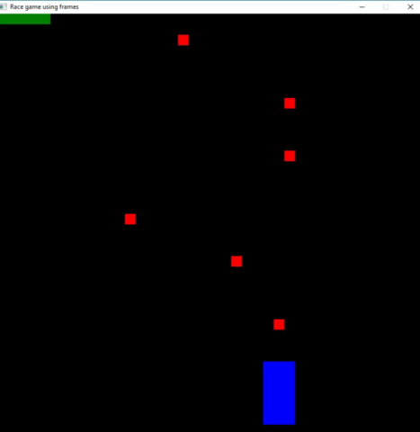

# Devolping a game using frames 

In the tutorial [Developing a game with pico-Céu from scratch](../race), we created a game based on old race games, where the player movement a car to deflect obstacles. Now, we'll create the same game but using frames, instead of drawing and cleaning graphics by ourselves. This tutorial will explain step by step how to create the game, but it's good to read the other tutorial to better understand the benefits of frames.



Create an empty file, named ```raceframes.ceu``` and add the following code to define the title of the window, its size and if a visual grid delimiting the screen pixels will be displayed or not (change the parameter from ```no``` to ```yes``` and check the difference). 

> The FRAMES_SET enables or disables the generation of periodic FRAMES_UPDATE and FRAMES_REDRAW inputs to the application.

```c#
emit WINDOW_SET_TITLE("Race game using frames");
emit WINDOW_SET_SIZE(40*20, 40*20, 40, 40);
emit WINDOW_SET_GRID(no);
emit FRAMES_SET(yes);
```

# The Car
The car will be represented as a blue rectangle, that can be moved to the left and right by keyboard arrow keys. After the ```emit FRAMES_SET(yes);``` add the following code.

```c#
code/await Car(none) -> (var Rect rct) -> NEVER do
    rct = val Rect(0, -18, 3, 6);

    par do
        var integer key = _;
        every key in KEY_PRESS do
            if key == KEY_LEFT then
                if (rct.x > -19) then
                    rct.x = rct.x - 1;
                end
            else/if key == KEY_RIGHT then
                if (rct.x < 18) then
                    rct.x = rct.x + 1;         
                end
            end        
        end
    with
        every FRAMES_REDRAW do
            emit GRAPHICS_SET_ANCHOR(HANCHOR_CENTER, VANCHOR_BOTTOM);
            emit GRAPHICS_SET_COLOR_NAME(COLOR_BLUE);
            emit GRAPHICS_DRAW_RECT(rct.x, rct.y, rct.w, rct.h);      
        end
    end    
end

var& Car car = spawn Car();

await FOREVER;
```

We defined a Car abstraction using a code/await statement that deals with the key presses and the rectangle drawing. After defining the Car abstraction, we instantiate one car using the spawn primitive, which starts the procedure defined inside the code/await to execute in the background. Since the spawn doesn't block, the code will proceed to the next line and reach the ```await FOREVER``` statement, that will keep the application alive.

At the first line of the above code, we defined that the Car procedure will not receive any parameters (```none```), will expose the field ```rct``` so that it can be accessed from outside the procedure abstraction (making it a public field), and ```NEVER``` finalizes.

At the next line, we defined the rectangle, using ```Rect``` and passing the x and y coordinates, and its width and height. Then, we used a parallel composition to create two trails that execute concurrently. The first trail (defined from ```par/or``` to ```with```) verifies the key presses and updates the x value of the rectangle, while the second one (from ```width``` to ```end```) draws a blue rectangle every frame. Note that we used a parallel-or, which means that if any of the trails terminate, the others will be aborted and the parallel composition will finalize, making the code proceed to the next line. In this case, since there is nothing after the parallel composition, the procedure will terminate.

## Verifing the key presses
In the first trail of the Car procedure, we execute the code between lines 7 and 15 every time a key is pressed, checking if the pressed key was the arrow left or the arrow right. All other keyboard keys are irrelevant to our application.

If the user clicks a left key, the car should move left, so the x position of the rectangle is decremented. If the right key is clicked, the x position is incremented. The "ifs" in lines 8 and 12 ensure that the car do not move off the window. 

The ```every``` statement works as an infinite loop, so that trail never finalize.

## Drawing a rectangle every frame
The code between line 20 and 22 is executed every time a ```FRAMES_REDRAW``` events occurs, i.e., on every frame, after ```FRAMES_UPDATE```. Before the input occurs, the screen is automatically cleared with ```WINDOW_CLEAR```.

We defined the anchor and the color of the rectangle and, then, drew it on screen using ```emit GRAPHICS_DRAW_RECT``` and passing the x, y, w and h (x and y coordinates, width and height) fields of the rectangle ```rct```.

# The LifeBar
The player's life is indicated by a green bar located in the top left corner of the screen. 

```c#
emit WINDOW_SET_TITLE("Race game using frames");
emit WINDOW_SET_SIZE(40*20, 40*20, 40, 40);
emit WINDOW_SET_GRID(no);
emit FRAMES_SET(yes);

event none gameOver;

code/await LifeBar(none) -> (event none decreaseLife, var integer life) -> NEVER do
    life = 5;

    par do
        loop do
            await decreaseLife;
            life = life - 1;
        end
    with
        every FRAMES_REDRAW do
            emit GRAPHICS_SET_ANCHOR(HANCHOR_LEFT, VANCHOR_TOP);
            emit GRAPHICS_SET_COLOR_NAME(COLOR_GREEN);
            emit GRAPHICS_DRAW_RECT(-20, 20, life, 1); 
        end
    end
end

code/await Car(none) -> (var Rect rct) -> NEVER do
    // ...
end

var& LifeBar lifeBar = spawn LifeBar();
var& Car car = spawn Car();

await FOREVER;
```

The LifeBar procedure has one public field (```life```, that stores the current life points the player has), and the event ```decreaseLife```, that should be called from outside the abstraction when there is a collision between the car and some obstacle.

The second trail of this abstraction draws the green rectangle every frame using the ```life``` variable, that stores the current life points the player has.

This variable initiates with the value 5, which means that when the user hit the fifth obstacle the game will terminate.

# The Obstacle
The obstacles of this game are represented by red pixels that move down to give the sensation that the car is in movement. Therefore, all the obstacles should initiate in the same y-axis position (19) and, from time to time, this position should be decremented. The x-axis position can variate from -20 to 19, that corresponds to the limits of the Window.

At the second line of the following code, we created a point with a random position on the x-axis and the value 19 for the y-axis. Then, we stored this point in the public field ```pt```.

The code between the curly braces are native C code. In this case, the C code result is stored in the Céu ```pt``` variable. To read more about the Céu C integration, check the [Céu online manual](https://ceu-lang.github.io/ceu/out/manual/v0.30/statements/#c-integration) and the section 3.3 of [this paper](http://www.ceu-lang.org/chico/ceu_sensys13_pre.pdf)

The ```rand``` function was used to choose a random number between -20 and 19 (respectively, the leftmost and the rightmost values of the x-axis).

```c#
code/await Obstacle(none) -> (var Point pt, event none collided) -> none do
    pt = val Point({rand()%40 - 20}, 19);
    
    par/or do
        var real y = pt.y;

        var integer dt;
        every dt in FRAMES_UPDATE do
            var real v = dt * -5.5;
            y = y + v/1000;
            pt.y = y as integer;
            
            if (pt.y <= -19) then
                escape;
            end
        end
    with
        every FRAMES_REDRAW do
            emit GRAPHICS_SET_COLOR_NAME(COLOR_RED);
            emit GRAPHICS_DRAW_PIXEL(pt.x, pt.y); 
        end
    with
        await collided;
    end
end
```

Next, we used a parallel-or to run three trails concurrently.

The first one is responsible to update the y value on ```FRAMES_UPDATE``` event, which occurs on every frame before ```FRAMES_REDRAW```. The ```dt``` variable stores the number of milliseconds elapsed since the previous frame. 

After updating the y-axis value, we check if we reached the bottom of the screen. If yes, we finalize the ```Obstacle``` abstraction using ```escape```.
This is the reason why we didn't use ```NEVER``` in the first line of the code. Unlike the Car and the LifeBar, the Obstacle terminates.

The second trail simply draws the obstacle using the ```GRAPHICS_SET_COLOR_NAME``` to choose the red color and the ```GRAPHICS_DRAW_PIXEL``` to draw a pixel in the x and y positions of ```pt``` point.

The last one only waits for a ```collided``` event, which should be emitted from outside the abstraction meaning that the car collided with that pixel. When the event arrives, this trails goes to the next line, finalizing. Since we are using a ```par/or```, all the parallel composition finalize, as well as the Obstacle code-await abstraction.

# Spawning the obstacles
We already saw that we start a procedure to execute in background using ```spawn```, and that we can store the instances in a variable. But now, we want to spawn multiple Obstacles from time-to-time, more exactly, one per second.

First, we specified where these obstacles would reside in memory. In this case, we chose an unbounded pool, that can stores how many obstacles instances the memory supports. Then, every one second we spawn an Obstacle instance and stores it in the pool;

```c#
// window setups and frameset
emit WINDOW_SET_TITLE("Race game using frames");
emit WINDOW_SET_SIZE(40*20, 40*20, 40, 40);
emit WINDOW_SET_GRID(no);
emit FRAMES_SET(yes);

// code/await declarations

var& LifeBar lifeBar = spawn LifeBar();
var& Car car = spawn Car();

pool[] Obstacle obstacles;
every 1s do
    spawn Obstacle() in obstacles;
end
```

Note that we don't need to use the ```await FOREVER``` anymore, since the every loop never terminates.

# Verifing the collisions and GameOver
While the game is spawning the Obstacles from time to time, we need to check if any collision occurred and if the player still has enough life to continue playing. To do that, we used, again, a par/or composition.
The first trails spawn an obstacle every second, while the second iterate over obstacles pool and check if it collided with the car rectangle using the function ```Intersects```. If there is a collision, we ask lifeBar to decrease the life by emitting the ```lifeBar.decreaseLife``` event, and notify the obstacle that a collision occurred by the ```obstacle!.collided``` event.

The exclamation mark is required when accessing variables that we are not sure that are defined. These variables also receive a question mark in its declaration: ```var&? Obstacle obstacle```. In our program, we do not use exclamation or question marks to store ```Car``` or ```LifeBar``` spawns because these procedures never terminate and the variables ```car``` and ```lifeBar```, consequently, always have a value. On the other hand, the ```obstacle``` variable defined on the second trail can became undefined.


```c#
// window setups and frameset
// code/await declarations
var& LifeBar lifeBar = spawn LifeBar();
var& Car car = spawn Car();

pool[] Obstacle obstacles;
par/or do
    every 1s do
        spawn Obstacle() in obstacles;
    end
with
    every FRAMES_UPDATE do
        var&? Obstacle obstacle;  
        loop obstacle in obstacles do
            if (call Intersects(car.rct, obstacle!.pt)) then
                emit lifeBar.decreaseLife;
                emit obstacle!.collided;
            end
        end
    end
with
    every FRAMES_UPDATE do
        if (lifeBar.life == 0) then
            break;
        end                
    end
end
```

In the last trail, we check if the player still have enough life by checking the ```lifeBar``` public field. If there is no life, the third trail terminates and, consequently, the parallel composition and the whole game.

# Displaying a GameOver message 
As a new feature, we want to display a Game Over message before the application terminates. To implement that, simply add the following code after the parallel composition. 

```c#
emit FRAMES_SET(no);
emit WINDOW_SET_SIZE(190*5, 120*5, 190, 120);
emit GRAPHICS_SET_COLOR_NAME(COLOR_WHITE);
emit GRAPHICS_SET_ANCHOR(HANCHOR_CENTER, VANCHOR_CENTER);
emit GRAPHICS_DRAW_TEXT(0, 20, "Game Over");
emit GRAPHICS_DRAW_TEXT(0, 0, "Press any key to restart");
await KEY_PRESS;
```

At the first line we disabled the generation of ```FRAMES_UPDATE``` and ```FRAMES_REDRAW```
so that the window is not cleared every frame. On the next lines, we set the window's size, chose the text's color and anchor, and displayed it with ```GRAPHICS_DRAW_TEXT```.
The last line awaits the player press any key to finalize the game.


## Code-await abstraction are drawing even with FRAMES_SET(no)


> The above gif forced the lifeBar remains visible to demonstrate that it is still drawing too.

Even with the ```FRAMES_UPDATE(no)```, the car, lifeBar and obstacles are drawing. We can enclose their declaration in a block using the ```do-end```. 

>A Block delimits a lexical scope for storage entities and abstractions, which are only visible to statements inside the block.

```c#
// window setups and frameset
// code/await declarations
do
    var& LifeBar lifeBar = spawn LifeBar();
    var& Car car = spawn Car();

    pool[] Obstacle obstacles;
    par/or do
        every 1s do
            spawn Obstacle() in obstacles;
        end
    with
        every FRAMES_UPDATE do
            var&? Obstacle obstacle;  
            loop obstacle in obstacles do
                if (call Intersects(car.rct, obstacle!.pt)) then
                    emit lifeBar.decreaseLife;
                    emit obstacle!.collided;
                end
            end
        end
    with
        every FRAMES_UPDATE do
            if (lifeBar.life == 0) then
                break;
            end                
        end
    end
end

//GAME OVER MESSAGE
emit FRAMES_SET(no);
emit WINDOW_SET_SIZE(190*5, 120*5, 190, 120);
emit GRAPHICS_SET_COLOR_NAME(COLOR_WHITE);
emit GRAPHICS_SET_ANCHOR(HANCHOR_CENTER, VANCHOR_CENTER);
emit GRAPHICS_DRAW_TEXT(0, 20, "Game Over");
emit GRAPHICS_DRAW_TEXT(0, 0, "Press any key to restart");
await KEY_PRESS;
```

Now, the ```car```, ```lifeBar``` and ```obstacles``` pool only live inside the ```do-end``` block. When the "game over" message will be displayed, the block already finalized and the variables ```car```, ```lifeBar``` and ```obstacles``` gone out of scope.

# Restarting the game
The last feature is to restart the game after the game over message: simply enclose everything after the code-await declarations in a loop and reset the windows size and enable the frames again.

```c#
// window setups and frameset
// code/await declarations
loop do
    do
        // ...
    end
    // GAME OVER MESSAGE
    emit WINDOW_SET_SIZE(40*20, 40*20, 40, 40);
    emit FRAMES_SET(yes);
end
```