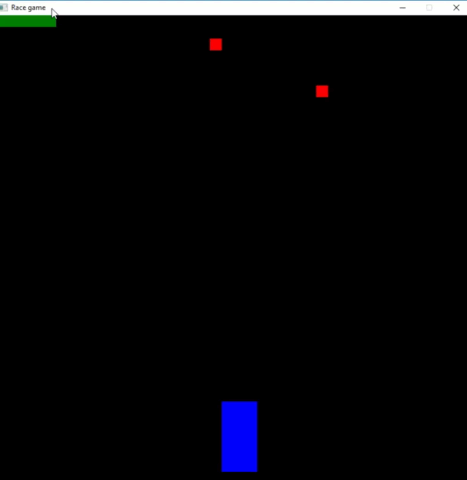
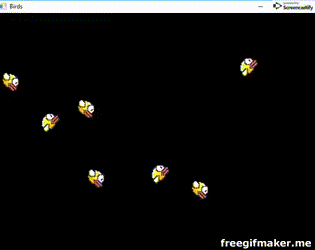
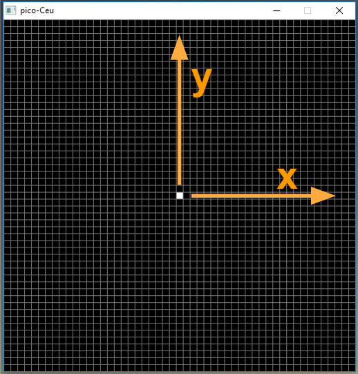
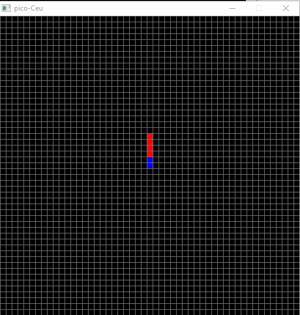
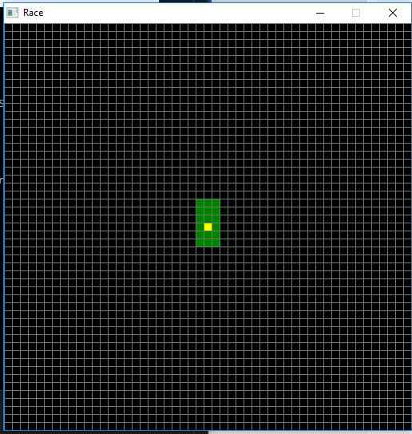
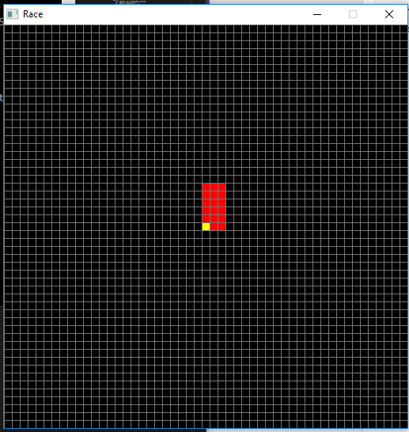
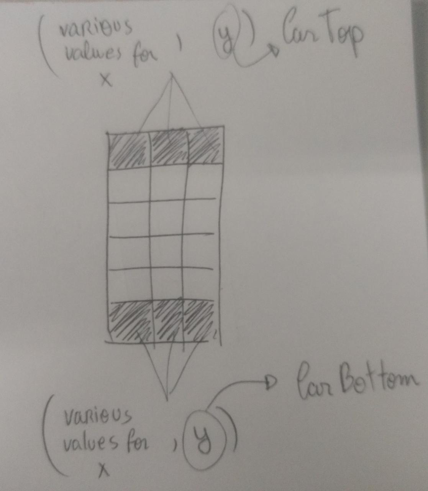
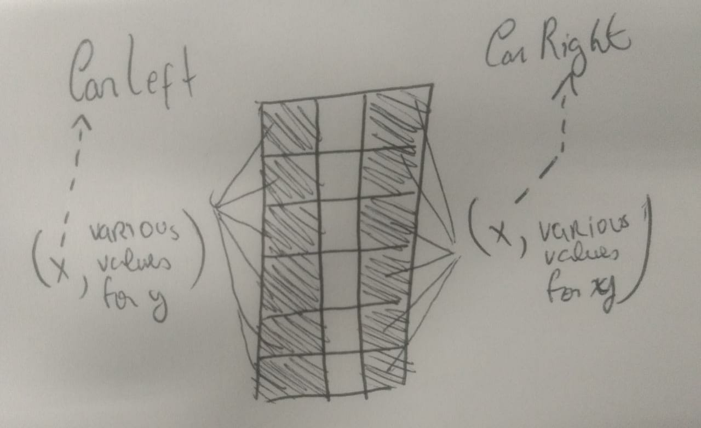
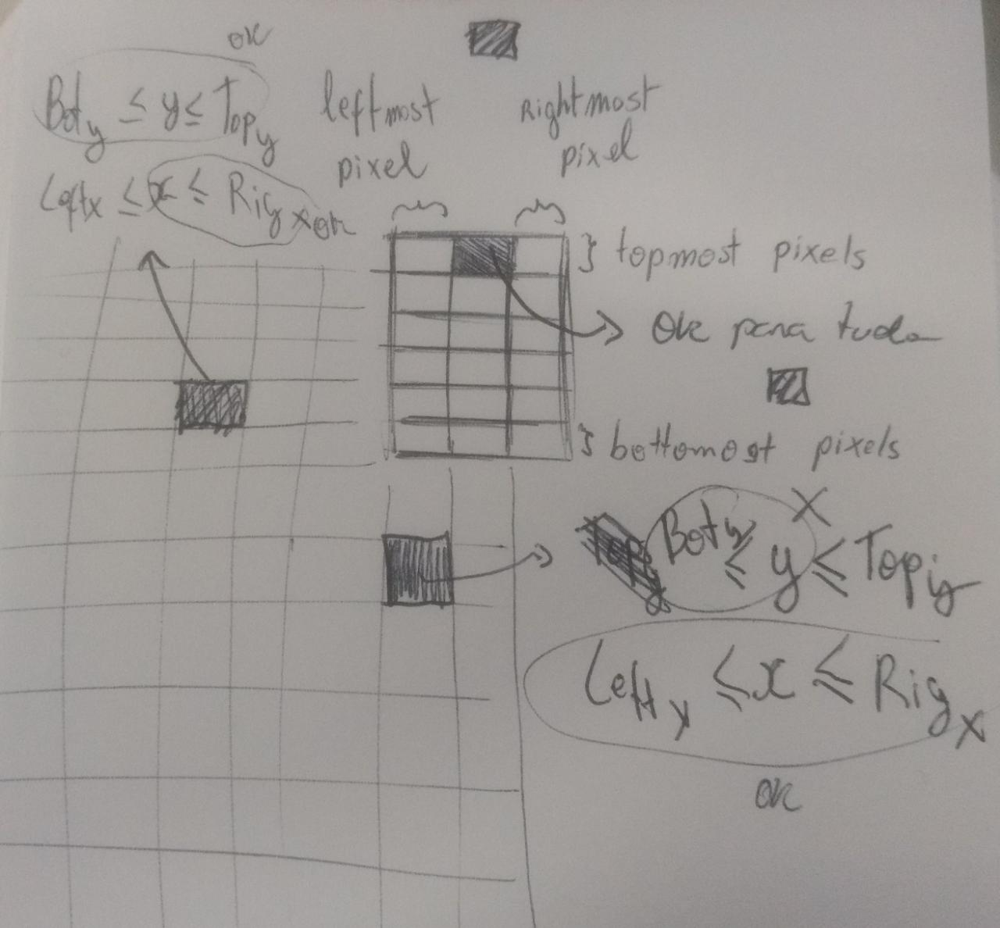

# Developing a game with pico-Céu from scratch

This tutorial will explain how to develop a game using pico-Céu environment. The game is basead in old race games, where the player movement a car to deflect obstacles.



# Summary
1. Installation
2. Starting to code
3. Drawing pixels and rectangles
    - Draw a pixel
    - Draw multiple pixels and set its colors
    - Draw a rectangle
    - Change the anchor
4. Styling the window
5. Drawing the car the obstacles
6. Moving a pixel
7. Making a pixel positon random 
8. Calling the Pixel abstraction
9. Trying to spawn in a full pool]
10. Making Pixel abstraction finalize
11. Trying to spawn 4 pixels again
12. Creating a Car procedure abstraction
13. Creating the colisions
    - The ideia
    - The implementation
14. Creating a life bar
15. Emiting the decreseLife event
16. Awaiting for the gameOver event
17. Emiting the Game over message
18. Awaiting for a key press
19. Restarting the application

> pico-Céu is a tiny programming environment for visual and interactive applications such as video games. It is composed of the programming language Céu and minimalist libraries for input, graphics, network, and sound.

## Installation
First of all, you need to install pico-Céu. Simply download the last stable release of Céu-Maker from [https://github.com/ceu-lang/ceu-maker/releases](https://github.com/ceu-lang/ceu-maker/releases) and double click on the downloaded exe. Choose the destination folder in the installer window and click *Install*. When the installation complets, two folders, one containing the binary from pico-Céu and other the code examples will be opened. 

> Céu-Maker is a programming environment that integrates Céu-Arduino and pico-Céu in a single package for Windows.
Although it supports Céu-Arduino, this tutorial will only cover programming with pico-Céu

To test if everything worked fine, drag and drop a pico-ceu code example (```examples\pico-ceu\birds.ceu```, for example) to ```bin\pico-Céu.exe```. The result must be similar to the gif below.  



## Starting to code
Create a file anywhere in your computer and name it ```race.ceu```. Just pay attention if the path of your file contains any white spaces — this can generate bugs in the compilation process.

## Drawing pixels and rectangles

### Draw a pixel
To start coding our game, we need to figure out how to draw the car and the obstacles. Let's start with a pixel. The below code draw a pixel in the 0,0 position, witch, by default, correspond to the middle of the window. 

```c#
emit GRAPHICS_DRAW_PIXEL(0,0);
```



pico-Céu uses a grid system that, by default, initiates from -25 to 25 in both x-axis and y-axis. The first parameter of ```GRAPHICS_DRAW_PIXEL``` correspond to the coordinate of the x-axis and the second, of the y-axis.

### Draw multiple pixels and set its colors
The function ```GRAPHICS_DRAW_PIXEL``` can be applied in sequence to draw more pixels:

```c#
//set the paint color to blue
emit GRAPHICS_SET_COLOR_NAME(COLOR_BLUE);

//draw a rectangle pixel by pixel
emit GRAPHICS_DRAW_PIXEL(0, 0);
emit GRAPHICS_DRAW_PIXEL(0, 1);

//set the paint color to red
emit GRAPHICS_SET_COLOR_NAME(COLOR_RED);

emit GRAPHICS_DRAW_PIXEL(0, 2);
emit GRAPHICS_DRAW_PIXEL(0, 3);
emit GRAPHICS_DRAW_PIXEL(0, 4);
emit GRAPHICS_DRAW_PIXEL(0, 5);

```



The ```GRAPHICS_SET_COLOR_NAME``` function is responsible for defining the color with which the pixels will be drawn. It is quite similar to the real world painting process. The painter chooses an ink, soak the brush with it (GRAPHICS_SET_COLOR_NAME) and draws pictures with this color (GRAPHICS_DRAW_PIXEL). To draw pictures with another color, he cleans the brush and soak it with a new ink.

### Draw a rectangle
In the previus code, we draw a rectangle pixel by pixel. A shorter way to do that is use the function ```GRAPHICS_DRAW_RECT```. It receives as parameters the initial cordinates of the rectangle (x and y) and its width and height. The code below draw a green rectangle and a yellow pixel in its center. Note that we used a different function to set the yellow color. The ```GRAPHICS_SET_COLOR_RGB``` works very similar to the ```GRAPHICS_SET_COLOR_NAME```, but instead of defining the color by its name, it uses the [RGB code](https://en.wikipedia.org/wiki/RGB_color_model).

```c#
emit GRAPHICS_SET_COLOR_NAME(COLOR_GREEN);
emit GRAPHICS_DRAW_RECT(0, 0, 3, 6);

emit GRAPHICS_SET_COLOR_RGB(255, 255,0);
emit GRAPHICS_DRAW_PIXEL(0, 0);
```



### Change the anchor

As we have seen, the reference coordinates of the rectangle corresponds to its center. We can change this by defining an anchor.

```c#
emit GRAPHICS_SET_ANCHOR(HANCHOR_LEFT, VANCHOR_BOTTOM);
emit GRAPHICS_SET_COLOR_NAME(COLOR_RED);
emit GRAPHICS_DRAW_RECT(0, 0, 3, 6);

emit GRAPHICS_SET_COLOR_NAME(COLOR_YELLOW);
emit GRAPHICS_DRAW_PIXEL(0, 0);
```



The first line of the above code define where the reference cordinates should be located in the rectangle. In this case, we choose that it should be located in its left (```HANCHOR_LEFT```) bottom(```VANCHOR_BOTTOM```) corner. You can play with anchor positions to see the differences.
- The first parameter defines the position of the anchor horizontaly, and its possible values are:
    - ```HANCHOR_LEFT```
    - ```HANCHOR_CENTER``` (default)
    - ```HANCHOR_RIGHT```
- The second parameter defines the position of the anchor verticaly, and its possible values are:
    - ```VANCHOR_TOP```
    - ```VANCHOR_CENTER``` (default)
    - ```VANCHOR_BOTTOM```

## Styling the window
As we already saw, pico-Céu displays a Window with a grid system. We can customize its name, with the  ```WINDOW_SET_TITLE("New Name")```, define if the grid will be displayed or not, with the ```WINDOW_SET_GRID(yes or no)```, and set the width and height of the window and how many pixels will be displayed in the x-axis and y-axis, with the ```WINDOW_SET_SIZE(width, height, pixels in x-axis, pixels in y-axis)```.

The code below shows how we customize our window.
```c#
emit WINDOW_SET_TITLE("Race game");
emit WINDOW_SET_SIZE(40*20, 40*20, 40, 40);
emit WINDOW_SET_GRID(no);
```

Since the last two parameters of ```WINDOW_SET_SIZE``` function specify how many pixels should exist in a specific axis, and the firt two, the total size of each axis, the division of the third parameter by the first, and the fouth by the second must be exact.

Note that in the above example we defined the first two parameters of ```WINDOW_SET_SIZE``` as the multiplication of two numbers: the **size of each pixel** and the **number of pixels displayed in a specific axis**. This can be a clear way to interpret this function.

## Drawing the car and the obstacles
For this game, we'll use a rectangle to simulate the car, and red pixels to simbolize the obstacles. The below code show the static draw of the elements of the game. Note that the car rectangle receives a negative number for the y-axis position to move it to the bottom of the screen.

```c#
emit GRAPHICS_SET_ANCHOR(HANCHOR_CENTER, VANCHOR_BOTTOM);
emit GRAPHICS_SET_COLOR_NAME(COLOR_BLUE);
emit GRAPHICS_DRAW_RECT(0, -18, 3, 6);

emit GRAPHICS_SET_COLOR_NAME(COLOR_RED);
emit GRAPHICS_DRAW_PIXEL(-13, 2);
emit GRAPHICS_SET_COLOR_NAME(COLOR_RED);
emit GRAPHICS_DRAW_PIXEL(10, 20);
emit GRAPHICS_SET_COLOR_NAME(COLOR_RED);
emit GRAPHICS_DRAW_PIXEL(5, 11);
emit GRAPHICS_SET_COLOR_NAME(COLOR_RED);
emit GRAPHICS_DRAW_PIXEL(6, 15);
```


## Moving a pixel
In our game, the pixels should move down to give the sensation that the car is in movement. Therefore, all the pixels should initiate in the same y-axis position(19) and, from time to time, this position should be decremented. The x-axis position can variate from -20 to 19, that corresponds to the limits of the Window.

To demonstrate how to code the movement, let's start moving only one pixel.

```c#
var integer y = 19;
every 150ms do
    if (y > -20) then
        y = y - 1;
    end

    emit GRAPHICS_SET_COLOR_NAME(COLOR_RED);
    emit GRAPHICS_DRAW_PIXEL(-13, y);
end


emit GRAPHICS_SET_COLOR_NAME(COLOR_GREEN);
emit GRAPHICS_DRAW_PIXEL(-10, 20);
```


In line 1, we define an integer variable to maintain the current position in the y-axis and set its initial value to 19. Next, we used an ```every``` construct to execute it's enclosed code every 150 milliseconds.
In line 5, we decrement the y position only if it's not on the bottom of the window yet.
Lines 8 and 9 are, as we already saw, responsable for setting the draw color and draw a pixel. The difference in that now we use the ```y``` variable in the ```GRAPHICS_DRAW_PIXEL``` instead of a static integer so it can draw its updated position.

ToDo: Gif


By running the above code, we can see some problems. The most notable is that the red pixel that we are trying to animate is not moving down, but drawing a line down. To solve this, we need to clean the current pixel before updating the y position and drawing it again on a new coordinate.

```c#
var integer y = 19;
every 150ms do
    //cleaning the old pixel
    emit GRAPHICS_SET_COLOR_NAME(COLOR_BLACK);
    emit GRAPHICS_DRAW_PIXEL(-13, y);    

    //updating the y postion
    if (y > -20) then
        y = y - 1;
    end

    //drawing a new pixel with updated y position
    emit GRAPHICS_SET_COLOR_NAME(COLOR_RED);
    emit GRAPHICS_DRAW_PIXEL(-13, y);
end
emit GRAPHICS_SET_COLOR_NAME(COLOR_GREEN);
emit GRAPHICS_DRAW_PIXEL(-10, 20);
```

A second problem is that the pixels that are drawn after ```every``` construct are not showing up. This occurs because ```every``` works as an infinite loop, that executes every 150 milliseconds. So, our code are stuck in this loop and never reaches the line 16 from the above code.

To solve this, we can enclose everything in a ```par``` composition, which executes two or more trails concurrently. In the code below we defined two trails, one between ```par do``` and ```with```, and another between ```with``` and ```end```, giving the sensation that both trails (one animating the red pixel and other drawing the green one) are executing at the same time.

```c#
par do
    var integer y = 19;
    var integer x = -13;
    every 150ms do
        //cleaning the old pixel
        emit GRAPHICS_SET_COLOR_NAME(COLOR_BLACK);
        emit GRAPHICS_DRAW_PIXEL(x, y);    

        //updating the y postion
        if (y > -19) then
            y = y - 1;
        end

        //drawing a new pixel with updated y position
        emit GRAPHICS_SET_COLOR_NAME(COLOR_RED);
        emit GRAPHICS_DRAW_PIXEL(x, y);
    end
with
    emit GRAPHICS_SET_COLOR_NAME(COLOR_GREEN);
    emit GRAPHICS_DRAW_PIXEL(-10, 20);
    
    //draw more pixels if you want
end
```
ToDo Gif:
https://youtu.be/C8EO0OByVdM

### "Copy and past" way
Ok, we animated one pixel and found a way to display the other ones, but our orinal idea was to have every pixel animated. One way of doing this, though rudimentary, would be to add one trail per pixel, which one beeing responsable to animate it.


```c#
par do
    var integer y = 19;
    var integer x = -13;
    every 150ms do
        //cleaning the old pixel
        emit GRAPHICS_SET_COLOR_NAME(COLOR_BLACK);
        emit GRAPHICS_DRAW_PIXEL(x, y);    

        //updating the y postion
        if (y > -19) then
            y = y - 1;
        end

        //drawing a new pixel with updated y position
        emit GRAPHICS_SET_COLOR_NAME(COLOR_RED);
        emit GRAPHICS_DRAW_PIXEL(x, y);
    end
with
    var integer y = 19;
    var integer x = 0;
    every 300ms do
        //cleaning the old pixel
        emit GRAPHICS_SET_COLOR_NAME(COLOR_BLACK);
        emit GRAPHICS_DRAW_PIXEL(x, y);    

        //updating the y postion
        if (y > -19) then
            y = y - 1;
        end

        //drawing a new pixel with updated y position
        emit GRAPHICS_SET_COLOR_NAME(COLOR_RED);
        emit GRAPHICS_DRAW_PIXEL(x, y);
    end
with
    var integer y = 19;
    var integer x = 5;

    await 3s;
    every 200ms do
        //cleaning the old pixel
        emit GRAPHICS_SET_COLOR_NAME(COLOR_BLACK);
        emit GRAPHICS_DRAW_PIXEL(x, y);    

        //updating the y postion
        if (y > -19) then
            y = y - 1;
        end

        //drawing a new pixel with updated y position
        emit GRAPHICS_SET_COLOR_NAME(COLOR_GREEN);
        emit GRAPHICS_DRAW_PIXEL(x, y);
    end
end
```

The above acode animate 3 pixels in 3 trails. We didn't modificate the first trail. The second one change its position every 300 milliseconds. The last one also have a different interval to update its position (200 milliseconds), but its most important part is the ```await``` statement, that makes the code await one second before proceeding to the next line. This makes the third trail waits 3 seconds before enter in the ```every``` construct, delaying the third pixel to appear.

Note, also, that all pixels start in a different x position.

ToDo: gif
https://youtu.be/5lR0R3ctgvc

### Enclosing the pixels in a code/await abstraction
We can see that the last code grows very quickly, and that it takes a lot of work to add a simple animation to three pixels. To avoid repetitive code, we can enclose the behavior of a pixel in a procedure abstration usign a ```code/await``` composition.

```c#
code/await Pixel(none) -> NEVER do
    var integer y = 19;
    var integer x = -13;
    every 150ms do
        //cleaning the old pixel
        emit GRAPHICS_SET_COLOR_NAME(COLOR_BLACK);
        emit GRAPHICS_DRAW_PIXEL(x, y);    

        //updating the y postion
        if (y > -19) then
            y = y - 1;
        end

        //drawing a new pixel with updated y position
        emit GRAPHICS_SET_COLOR_NAME(COLOR_RED);
        emit GRAPHICS_DRAW_PIXEL(x, y);
    end
end
```

In the first line we defined a Pixel abstraction using ```code/await```. The abstration don't receive any parameters (because of that we use the ```none```) and ```NEVER``` ends. We can notice that by the ```every``` compositon, witch, as already mentioned in this tutorial, runs infinitely, like an infinite loop.

## Making the pixel position random 
With the Pixel abstraction, our pixels would appear in the same x position. Let's make it's x position random.

To do that, we can use the C++ function ```rand``` to choose a number beetween -20 and 19 (respectively, the leftmost and the rightmost pixel of the Window).
```c#
code/await Pixel(none) -> none do
    var integer y = 19;
    var integer x = {rand()%40 - 20};
    // hidden code
end
```
The code between the curly braces are native c code. In this case, the C code result is stored in the Céu x variable. To read more about the Céu C integration, check the [Céu online manual](https://ceu-lang.github.io/ceu/out/manual/v0.30/statements/#c-integration) and the section 3.3 of [this paper](http://www.ceu-lang.org/chico/ceu_sensys13_pre.pdf)

## Calling the Pixel abstraction

Now, we can call the Pixel abstration how many times we want, needing only to specify where these pixels will reside in memory.
```c#
//add this code after the code/await declaration
pool[3] Pixel pixels;
spawn Pixel() in pixels;
await FOREVER;
```

ToDo: gif
https://youtu.be/5lR0R3ctgvc

In the second line, we created a pool to serve as a container for 3 code-await instances. In the next line we spawned a Pixel instance and saved it in the pool. The spawn primitive starts the procedure to execute in the background. Since the spawn doesn't block, the code will proceed to the next line and we'll reach the ```await FOREVER`` statement, that will keep the application alive.

## Trying to spawn in a full pool
However, if we try to spawn more than 3 pixels, we'll notice that the last one will not be created. This occurs because our pool is full. 

```c#
//add this code after the code/await declaration
pool[3] Pixel pixels;
spawn Pixel() in pixels;
spawn Pixel() in pixels;
spawn Pixel() in pixels;
spawn Pixel() in pixels;
await FOREVER;
```

Note that the pixels never finallize, even when they reaches the end of the screen. Because of that a pool position will never be released, preventing more pixels to be allocated. Let's change our procedure abstraction to finalize when a pixel reaches the end of the screen.

## Making Pixel abstraction finalize
```c#
code/await Pixel(none) -> none do
    var integer y = 19;
    var integer x = {rand()%40 - 20};
    every 150ms do
        //cleaning the old pixel
        emit GRAPHICS_SET_COLOR_NAME(COLOR_BLACK);
        emit GRAPHICS_DRAW_PIXEL(x, y);    

        //updating the y postion
        if (y > -19) then
            y = y - 1;
        else
           break;
        end

        //drawing a new pixel with updated y position
        emit GRAPHICS_SET_COLOR_NAME(COLOR_RED);
        emit GRAPHICS_DRAW_PIXEL(x, y);
    end
end
```

The first change was in the line 1, where we substitute ```-> NEVER``` to ```-> none```. This means that the code-await abstration will no longer execute forever and will not return anything. The other change was the addition of the lines 12 and 13, that breaks the "every" infinite loop when the pixel reaches the bottom of the screen.
Now, when a pixel reaches the bottom of the screen, the break will stop the "every" loop, and consequently finalize the procedure and release a position in the pool.

## Trying to spawn 4 pixels again
After this modification, let's check if now we can include one more pixel in the pool.

```c#
await 7s;
pool[3] Pixel pixels;

spawn Pixel() in pixels;
spawn Pixel() in pixels;
spawn Pixel() in pixels;
spawn Pixel() in pixels;

await FOREVER;
```

ToDo: gif

As we can see, the last pixel do not apear in the execution. This occurs because when we try to spawn the last pixel, no one reached the bottom of the screen yet, so we didn't have space in the pool. Logically, let's wait a little time before trying to spawn a forth pixel. 5 seconds should be enough.

```c#
await 7s;
pool[3] Pixel pixels;

spawn Pixel() in pixels;
spawn Pixel() in pixels;
spawn Pixel() in pixels;
awaits 5s;
spawn Pixel() in pixels;

await FOREVER;
```

ToDo: gif

### Make the pixel spawns more dinamic
We figured out how to animate four pixels. But what we should do to animate more ones? We could add more lines of code, attempting to whether the pool has free space. But in our game the pixels should never stops to appear. If we want to keep this way of programming, our code should be infinity, what is obviously impossible.

A way to solve this, is use a construct to spawn a Pixel from time to time.

```c#
pool[3] Pixel pixels;

every 1s do
    spawn Pixel() in pixels;
end
```

Note that we don't need the ```await FOREVER``` anymore, because the application in stucked in the every infinite loop.

Executing this code we can see that the pool is small for the quantity of pixels we are trying to spawn in it. The gaps in which should appear a pixel, the application simply don't spawn anything because of the lack of space. 
In other words, every 1 second the application tries to spawn a Pixel in the pool, but sometimes there is no free space.

We can increase the size of the pool (a pool of 6 positions should be enough) or even create an unbounded pool: ```c# pool[] Pixel pixels;```, that can stores how many Pixel the computer memory supports. For this tutorial, let's proceede with an unbounded pool.

## Creating a Car procedure abstraction
We can also enclose the car in a code/await abstraction. Even don't having multiple cars in our application, we can take advantage from a procedure abstraction enclosing all behaviour related to the car in a single place.

The Car procedure abstration has some similarities with the Pixel. The code below also have the definition of the integer variables x and y, in this case carring the default values of the car and an "every" loop that enclose the clean, update and draw code, but in this case the "every" runs every time a keyboard key is pressed by the user. The pressed key is stored in the integer variable ```key```, that is initiated with an empty value (```_```).

In the UPDATE, we check if the pressed key was the arrow left or the arrow right. All other keyboard keys are irrelevant to our application. If the user clicks a left key, the car should move left, so the x position is decremented. If the right key is clicked, the x position is incremented. The "ifs" in lines 14 and 18 ensures that the car do not move off the screen. Finally, as we did in the Pixel procedure, the x and y variables are used in the DRAW section to draw an updated graphic, in this case a rectangle.

```c#
code/await Car(none) -> NEVER do
    var integer x = 0;
    var integer y = -10;

    var integer key = _;

    every key in KEY_PRESS do
        //CLEAN
        emit GRAPHICS_SET_COLOR_NAME(COLOR_BLACK);
        emit GRAPHICS_DRAW_RECT(x, y, 3, 6);

        //UPDATE
        if key == KEY_LEFT then
            if (x > -19) then
                x = x - 1;
            end
        else/if key == KEY_RIGHT then
            if (x < 18) then
                x = x + 1;
            end
        end

        //DRAW
        emit GRAPHICS_SET_ANCHOR(HANCHOR_CENTER, VANCHOR_BOTTOM);
        emit GRAPHICS_SET_COLOR_NAME(COLOR_BLUE);
        emit GRAPHICS_DRAW_RECT(x, y, 3, 6);
    end
end

```

Now all you have to do is spawn the Car with the code bellow:
```c#
spawn Car();
```

## Creating the colisions

### The ideia 
A way to identify the collisions between the obstacles (the pixels) and the car rectangle is identifying when an obstacle is inside the rectangle.

ToDo: replace with a better image - unify in a single image


In other words, defining the CarTop, CarBottom, CarLeft and CarRight as in the figure above, we can check if a collision occurs checking if:

(CarLeft <= Pixel_X <= CarRight) and (CarBottom <= Pixel_Y <= CarTop)

The image below illustrates four cases when a pixel do not collide with the car and two in which it collide.

ToDo: replace with a better image

### The implementation
Until now we have two procedures abstractions in our code, the Pixel and the Car, and we want to include the collision detection. Where should we add code for that?

If we include this detection in the Car procedure, we should verify if the rectangle are colliding with each obstacle and then, if collision occurs, make the obstacle disappear. It's possible to do that, but everytime a obstacle moves we will have to iterate over all the obstacles, check the collisions for each one and make it disappear if collided. We have two problems with this approach:
- the car procedure is doing a lot of sequential work, by iterations over the positions of other elements;
- the ostacles procedures are no longer autonomous. The Car procedure have to take care of the obstacles and finalize it when necessary.

So, let's try to include the collision check in the Pixel procedure. This way, we do not need to change the lifecicle of other elements and each obstacle take care of itself, verifing if it collided or not and finalizing if collided. We'll only need to access some properties of the Car: the CarLeft, CarRight, CarBottom and CarTop (as explaned on the last section).

#### Including the CarLeft, CarRight, CarBottom and CarTop in the Car procedure
In a code/await statement, we can make a filed public like that:
```c#
code/await My_Procedure (none) -> (var int y) -> NEVER do
    y = x; // "y" is a public field

    await FOREVER;
end

var& My_Procedure p = spawn My_Procedure();
_printf("y=%d\n", p.y);    // prints "y=10"
```

As we see in the code above, the ```y``` field can be accessed outside ```My_Procedure```. It is also important to mention the ```printf``` call. The ```printf```, as well as the ```random``` function already used in this tutorial, is a native C function. Céu allows the call of native functions using curly braces and the underscore character. This way, we could also call the ```printf``` function this way:
```c#
{printf("hello world");}
```

Returning to our game, let's make the CarLeft, CarRight, CarBottom and CarTop publics.
```c#
code/await Car(none) -> (var integer top, var integer bottom, var integer left, var integer right) -> NEVER do
    var integer x =   0;
    var integer y = -10;
    var integer w =   3;
    var integer h =   6;

    //DIMENTIONS DEFAULT VALUES
    bottom = y;
    top    = y + h - 1;
    left   = x - 1;
    right  = x + 1;

    //INITIAL DRAW <...>

    var integer key = _;

    every key in KEY_PRESS do
        //CLEAN SECTION <...>

        //UPDATE
        if key == KEY_LEFT then
            if (x > -19) then
                x      = x - 1;
                left   = x - 1;
                right  = x + 1;
            end
        else/if key == KEY_RIGHT then
            if (x < 18) then
                x      = x + 1;
                left   = x - 1;
                right  = x + 1;                
            end
        end        

        //DRAW SECTION <...>
    end
end
```

In the line 1 we defined the public fields, and in the lines 8, 9, 10 and 11 we set its initial values. Note that we didn't need to declare the variables, they were already declared in the first line of the procedure. The last modification was in the update section. When we move the car, the ```left``` and ```right``` fields should be also updated. Since the car only moves horizontaly, there is no need to update the ```top``` and the ```bottom``` fields.

#### Accessing the Car public fields
Before implement the collision verification, let's try to access the Car public fields from the Pixel procedure.

At this phase, your code should look similar to this:
```c#
code/await Pixel(none) -> none do
// <...>
end

code/await Car(none) -> (var integer top, var integer bottom, var integer left, var integer right) -> NEVER do
// <...>
end

spawn Car();
pool[3] Pixel pixels;

every 1s do
    spawn Pixel() in pixels;
end
```

We need to have a reference to the Car procedure to access something from it. Until now, the is beeing spawned but not stored anywere. Let's store it in a variable. 
```c#
var& Car car = spawn Car();
```

The ```&``` means that the car variable is actually an alias. We don't need to understant this concept for now, so let's just assume that the alias is a simple variable.

Until here, we didn't talk about code order, but now it is necessary.
- The ```spawn Car();``` needs that the Car procedure has been defined. So this line of code should be located after the Car code/await definition. 
- As we argued, the Pixel procedure will access the Car public fields. To do that, it needs to access the ```car variable```. So the ```spawn Car();``` must be located before the Pixel code/await definition.

reordering the code, we get:
```c#
code/await Car(none) -> (var integer top, var integer bottom, var integer left, var integer right) -> NEVER do
// <...>
end

spawn Car();

code/await Pixel(none) -> none do
// <...>
end

pool[] Pixel pixels;

every 1s do
    spawn Pixel() in pixels;
end
```

Now, in the Pixel procedure we can access the car public fields to check the collision:
```c#
code/await Pixel(none) -> none do
    var integer y = 19;
    var integer x = {rand()%40 - 20};

    every 150ms do
        emit GRAPHICS_SET_COLOR_NAME(COLOR_BLACK);
        emit GRAPHICS_DRAW_PIXEL(x, y);
        //updating the y postion
        if (y > -19) then
            y = y - 1;
        else
            break;
        end

        //CHECK COLLISION
        if ( (y <= outer.car.top) and (y >= (outer.car.bottom-1)) and x <= outer.car.right and x >= outer.car.left) then
            break;
        else
            //drawing a new pixel with updated y position
            emit GRAPHICS_SET_COLOR_NAME(COLOR_RED);
            emit GRAPHICS_DRAW_PIXEL(x, y);
        end
    end
end
```

In this code, we first update the y value of the pixel. Next, we check if this new position will collide with the Car checking their public fields. If there was a collision, we use the command ```break``` to finalize the ```every``` loop and, consequently, the Pixel procedure. If there was no collision, we can draw the pixel with the color red.

Note that to access the fields, was necessary to use the variable that holds the procedure spawn, in this case ```car```. We used ```outer``` because ```car``` variable was defined outside the ```Pixel``` procedure, globally.

#### Solving a bug in Pixel procedure
Every time an obstacle changes it's position, the last one is painted black, but sometimes the last position is inside the rectangle, producing a black square in it.
ToDo: add the gif of the bug

To solve this, substitute the check collision if with the code below:
```c#
//CHECK COLLISION
if ( (y <= outer.car.top) and (y >= (outer.car.bottom-1)) and x <= outer.car.right and x >= outer.car.left) then
    emit outer.lifeBar.decreaseLife;

    if (y < outer.car.top) then
        emit GRAPHICS_SET_COLOR_NAME(COLOR_BLUE);
        emit GRAPHICS_DRAW_PIXEL(x, y+1);       
    end
    break;
else
    // <...>
```

When an obstacle colides with the car, we'll no longer paint the last position with black, but with blue. However, if an obstacle colide with the car top pixels, it will continues to have its last position painted black because its last position would be located outside the rectangle, more precisly, one pixel above it (this behavior is guaranteed by the ```if``` in line 5).

ToDo: add gif

## Creating a life bar
As a new feture, we want to implement a life bar to show how many times a user can colide with the obstacles before the Game Over.

ToDo: gif da barra de vida

A life bar is an autonomous element that update itself and produces graphical feedback. We can, then, implement it using a code-await procedure.

```c#
code/await LifeBar(none) -> (event none decreaseLife, event none gameOver) -> NEVER do
    var integer maxLife = 5;
    var integer life = maxLife;

    loop do
        //ANCHOR
        emit GRAPHICS_SET_ANCHOR(HANCHOR_LEFT, VANCHOR_TOP);

        //CLEAN
        emit GRAPHICS_SET_COLOR_NAME(COLOR_BLACK);
        emit GRAPHICS_DRAW_RECT(-20, 20, maxLife, 1);

        //REDRAW
        emit GRAPHICS_SET_COLOR_NAME(COLOR_GREEN);
        emit GRAPHICS_DRAW_RECT(-20, 20, life, 1);

        await decreaseLife;
        life = life - 1;

        if (life <= 0) then
            emit gameOver;
        end
    end
end
```

The LifeBar procedure has two fields: the ```life```, that stores the currenty life points the user still have, and the ```maxLife```, that stores the maximum life points the user can have.
In the line 3, we defined that the user initiate the game with the maximun life, that is set in line 2 with the value 5, which means the car can colide 5 times with the obstacles to finalize the game with a Game Over message. 

On lines 13 to 15 we draw a green rectagle in top left corner of the window with height equals 1 and length equals to the ```life``` variable content, that will produce a bar in which every pixel simbolize a life point. But before we draw the bar, we need to clean the window space reserved fo the bar. This is done on lines 9 to 11, where we draw a black (the color of the window background) rectangle to clean all the bar. We used the ```maxLife``` to ensure that all the bar will be cleaned. Try to replace the ```maxLife``` in line 11 with ```life``` to see the behavior difference.

On line 16 we are awaiting for an event. In Céu, we can use internal events as a signaling mechanism among trails. A program can ```await``` for internal events, which can be signaled through the ```emit``` statement.

> Internal events, unlike external events, do not represent real devices and are defined by the programmer. Internal events serve as signalling and communication mechanisms among trails in a program.

In the LifeBar procedure, we are awaiting for a ```decreseLife``` event and emiting a ```gameOver``` event. We didn't discussed yet from when the ```decreseLife``` event will be emitted, but is certainly from other trail. By the semantics of our game, we also know that the life should be decresed when the car collides with an obstacle.

When the LifeBar receives the ```decreseLife``` event, the ```life``` variable is decremented. On line 20, we verify if the life points are over. If yes, we emit a ```gameOver``` event, that should be treated by other trail.

It's important to mention that the events are declared as public fields (on the line 1) so that the rest of the application could emit or await then.

## Emiting the decreseLife event
Where should we emit the ```decreseLife``` event? As said, by the semantics of our game, we know that the life should be decresed when the car collides with an obstacle. So, the best place to emit this event is after verifing if a collision happened.

Then, in the Pixel procedure, right after the collision check, add ```c# emit outer.lifeBar.decreaseLife; ```.

```c#
    code/await Pixel(none) -> none do
        var integer y = 19;
        var integer x = {rand()%40 - 20};

        every 150ms do
            // <...>

            //CHECK COLLISION
            if ( (y <= outer.car.top) and (y >= (outer.car.bottom-1)) and x <= outer.car.right and x >= outer.car.left) then
                emit outer.lifeBar.decreaseLife;

            // <...>
        end
    end
```

Note that we access and public event in the same way that we access a variable.

## Awaiting for the gameOver event
After receiving the gameOver event, we want that our game emits a "Game Over" message an then, after the user press any key, restart the game.

When the gameOver event is received, the whole application should restart. So, we should await for this event in the application context, no inside any of the created procedures, because the application should take care of itself, not the car, the obstacle or even the life bar.

```c#

par/or do
    pool[] Pixel pixels;

    every 500ms do
        spawn Pixel() in pixels;
    end
with
    await lifeBar.gameOver;
end
```

We can implement this, waiting for the gameOver event in parallel with the Pixel spawns. Now, the application ends right after receiving the gameOver event from a Pixel procedure.


## Emiting the Game over message
To show up the game over message, we'll use the ```GRAPHICS_DRAW_TEXT```. It receives as parameters, the position in the x-axis, in the y-axis and the text to draw.

```c#
par/or do
    pool[] Pixel pixels;

    every 500ms do
        spawn Pixel() in pixels;
    end
with
    await lifeBar.gameOver;
end

//GAME OVER
emit WINDOW_CLEAR();
emit WINDOW_SET_SIZE(190*5, 120*5, 190, 120);
emit GRAPHICS_SET_COLOR_NAME(COLOR_WHITE);
emit GRAPHICS_SET_ANCHOR(HANCHOR_CENTER, VANCHOR_CENTER);
emit GRAPHICS_DRAW_TEXT(0, 20, "Game Over");
emit GRAPHICS_DRAW_TEXT(0, 0, "Press any key to restart");
await 2s;
```

Before drawing the text, we need to clean the window (line 2), and set the text color (line 4). Also, we changed the window size so the text could be well displayed. Try to comment the line 3 to see the changes.

Now, the application will emit a gameover message before finallize. We added the last line ( ```c# await 2s;```) so that the user can have time to see the text before the application ends.

## Awaiting for a key press
Instead of waiting 2 seconds, we can await for a key press. To do that, simply replace the  ```c# await 2s;``` with  ```c# await KEY_PRESS;```. Now, when the game over message is displayed, the user has to press an key to the game finallize.

## Restarting the application
To restart the application we need to neast our code insude a loop, so that the application don't finalize.

```c#
emit WINDOW_SET_TITLE("Race game");
emit WINDOW_SET_GRID(no);

code/await LifeBar(none) -> (event none decreaseLife, event none gameOver) -> NEVER do
    // <...>
end

code/await Car(none) -> (var integer top, var integer bottom, var integer left, var integer right) -> NEVER do
    // <...>
end

loop do
    emit WINDOW_SET_SIZE(40*20, 40*20, 40, 40);

    var& LifeBar lifeBar = spawn LifeBar();
    var& Car car = spawn Car();

    code/await Pixel(none) -> none do
        // <...>
    end

    par/or do
        pool[] Pixel pixels;

        every 500ms do
            spawn Pixel() in pixels;
        end
    with
        await lifeBar.gameOver;
    end

    //GAME OVER
    emit WINDOW_CLEAR();
    emit WINDOW_SET_SIZE(190*5, 120*5, 190, 120);
    emit GRAPHICS_SET_COLOR_NAME(COLOR_WHITE);
    emit GRAPHICS_SET_ANCHOR(HANCHOR_CENTER, VANCHOR_CENTER);
    emit GRAPHICS_DRAW_TEXT(0, 20, "Game Over");
    emit GRAPHICS_DRAW_TEXT(0, 0, "Press any key to restart");

    //WAIT A KEY_PRESS TO RESTART
    await KEY_PRESS; 
end
```

The modifications were:
- we moved the ```c# WINDOW_SET_SIZE``` from the top of the code to the beginning of the loop to redefine the window size every time the game restarts;
- we need to restart all the application after an game over, so, intuitively, all the game elements (car, life bar and obstacles) must also restart. We could do that in 2 different ways:
    - adding code to the procedure to restart the element (set the default values to the fields, for example) that we could call externally;
    - kill the elements and spawn again.

    The code/await abstraction are subsjects to the lexical scope just like local variables are. This means that when the scope in which the procedure were spawned terminates, the code/await also termintes.